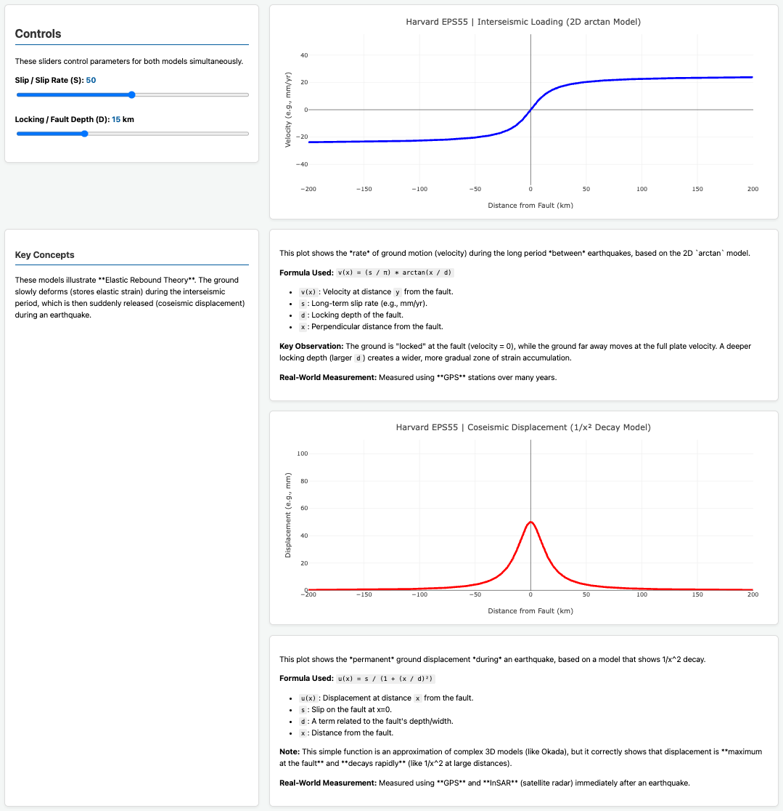
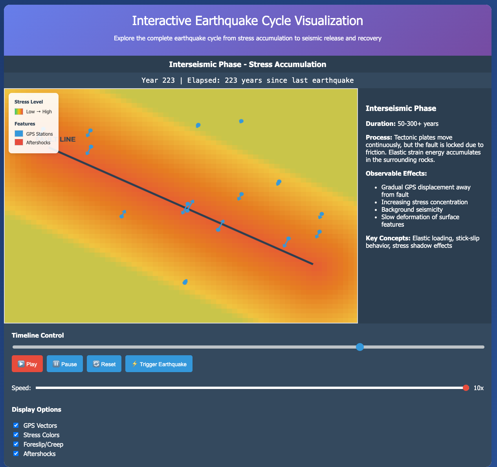
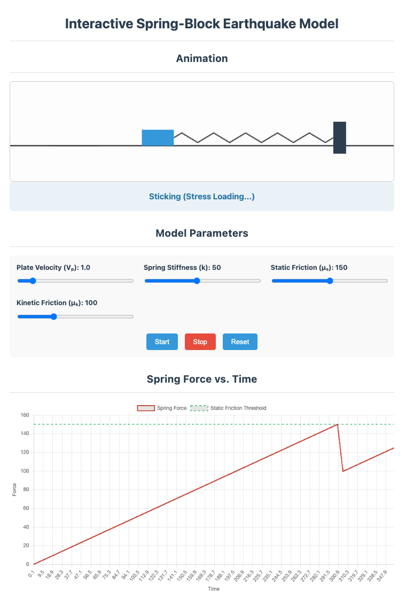
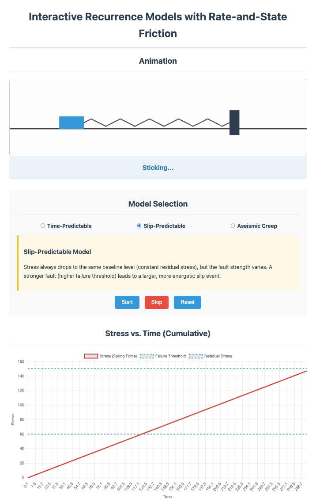
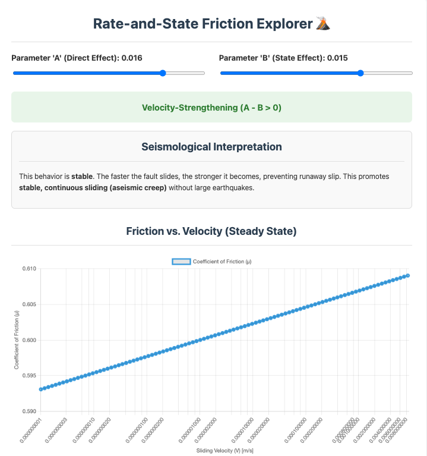

# Harvard EPS55

## Interactive Visualizations

### Click on each image to see the live interactive version:

### Earth's Timeline with Human Population Explosion

### Earthquake Timeline: Magnitude vs. Human Impact

---------------------------------------------------------
## Lecture 2: Geological Faults

#### Fault types!

#### Fault orientations (Strike, Dip, and Rake angles)!

#### Mohr-Coulomb Failure!

Increase principal stresses - try adjusting the sliders so the blue Mohr circle clearly crosses the red failure envelope. Watch the Mohr circle grow until it touches the failure line. You’ll see:

Change material properties - see how stronger materials (higher c, φ) resist failure

Compare different scenarios - weak vs. strong materials under various stress conditions

Understand the physics - why normal stress increases shear resistance

---------------------------------------------------------
## Lecture 6: Earthquake Cycle

#### Coseismic Ground Displacement!

#### Interseismic-Coseismic-Postseismic Phases!

#### Interactive Spring-Block Earthquake Model!

#### Interactive Recurrence Models with Rate-and-State Friction!

#### Rate-and-State Friction Explorer!

---------------------------------------------------------
