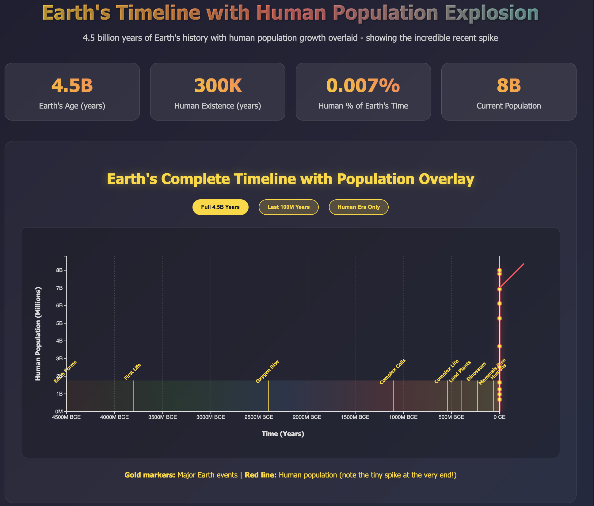
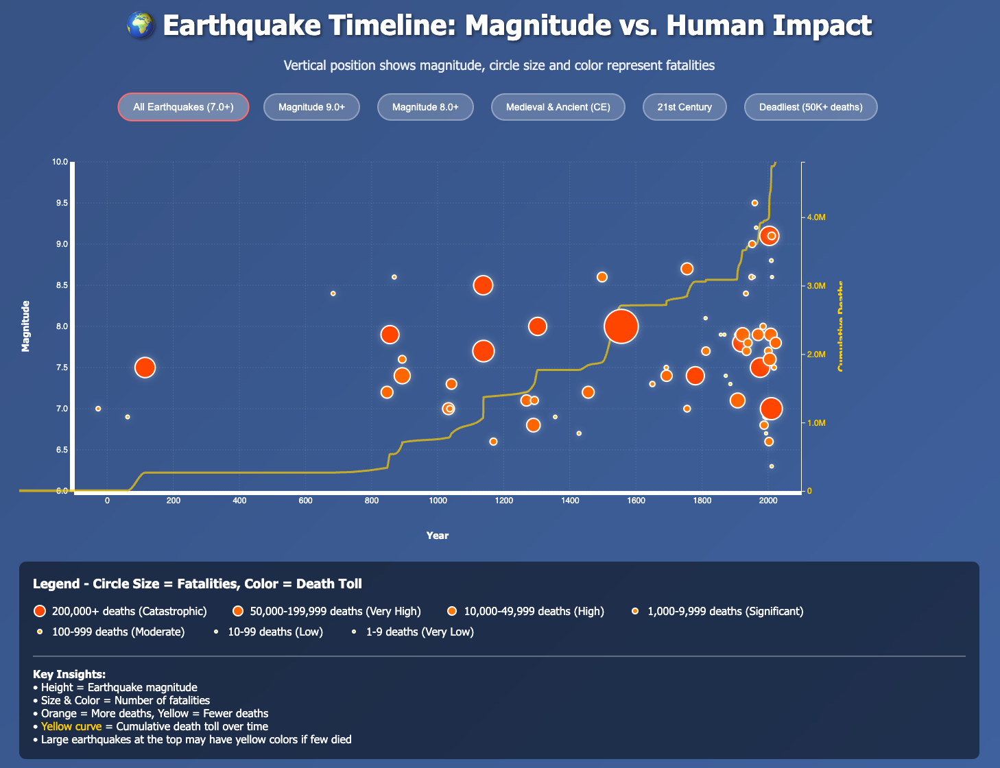
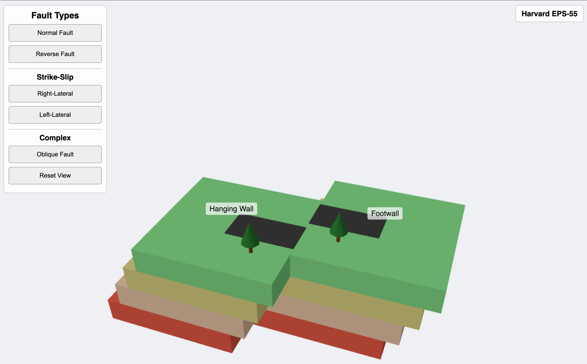
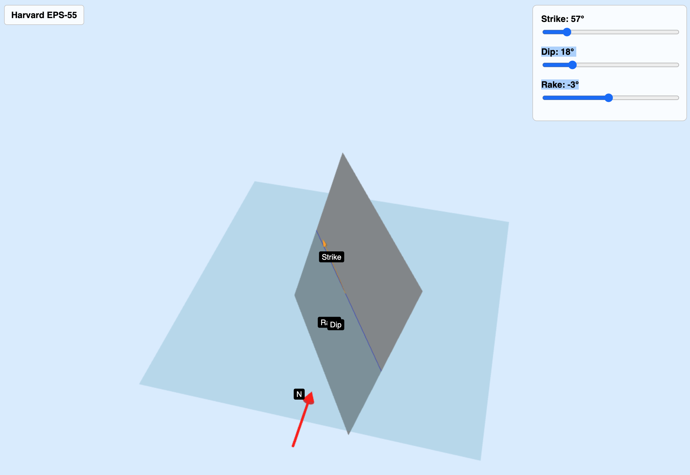
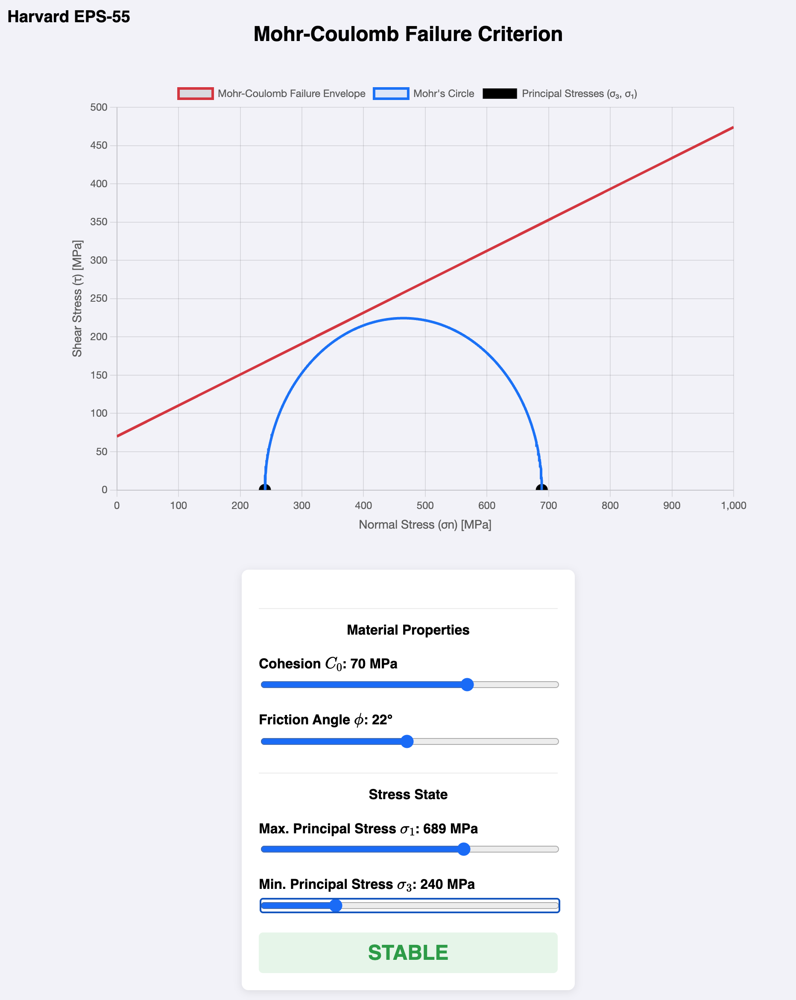

# Harvard EPS55

## Interactive Visualizations

### Click on each image to see the live interactive version:

L02 ---------------------------------------------------------

#### Fault types!

#### Fault orientations (Strike, Dip, and Rake angles)!

#### Mohr-Coulomb Failure!

Increase principal stresses - try adjusting the sliders so the blue Mohr circle clearly crosses the red failure envelope. Watch the Mohr circle grow until it touches the failure line. You’ll see:

Change material properties - see how stronger materials (higher c, φ) resist failure

Compare different scenarios - weak vs. strong materials under various stress conditions

Understand the physics - why normal stress increases shear resistance

---------------------------------------------------------
