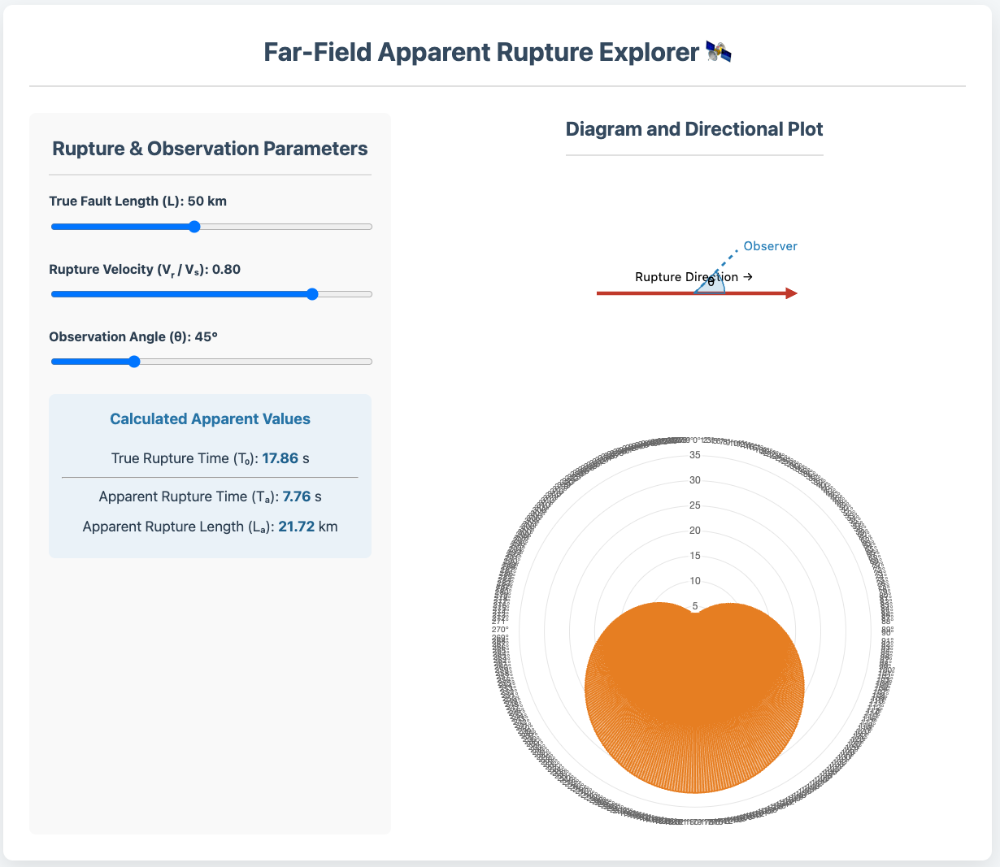
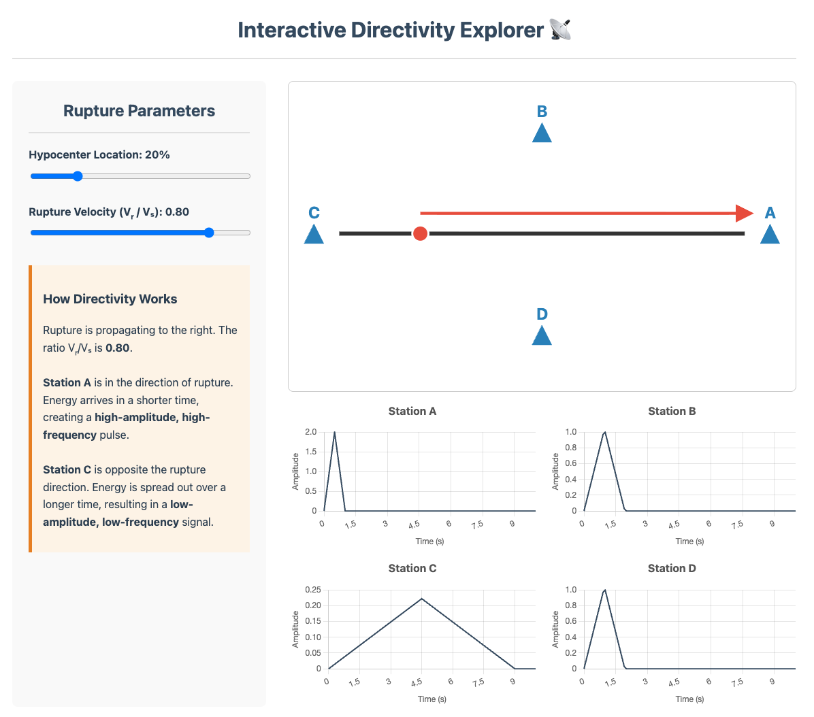
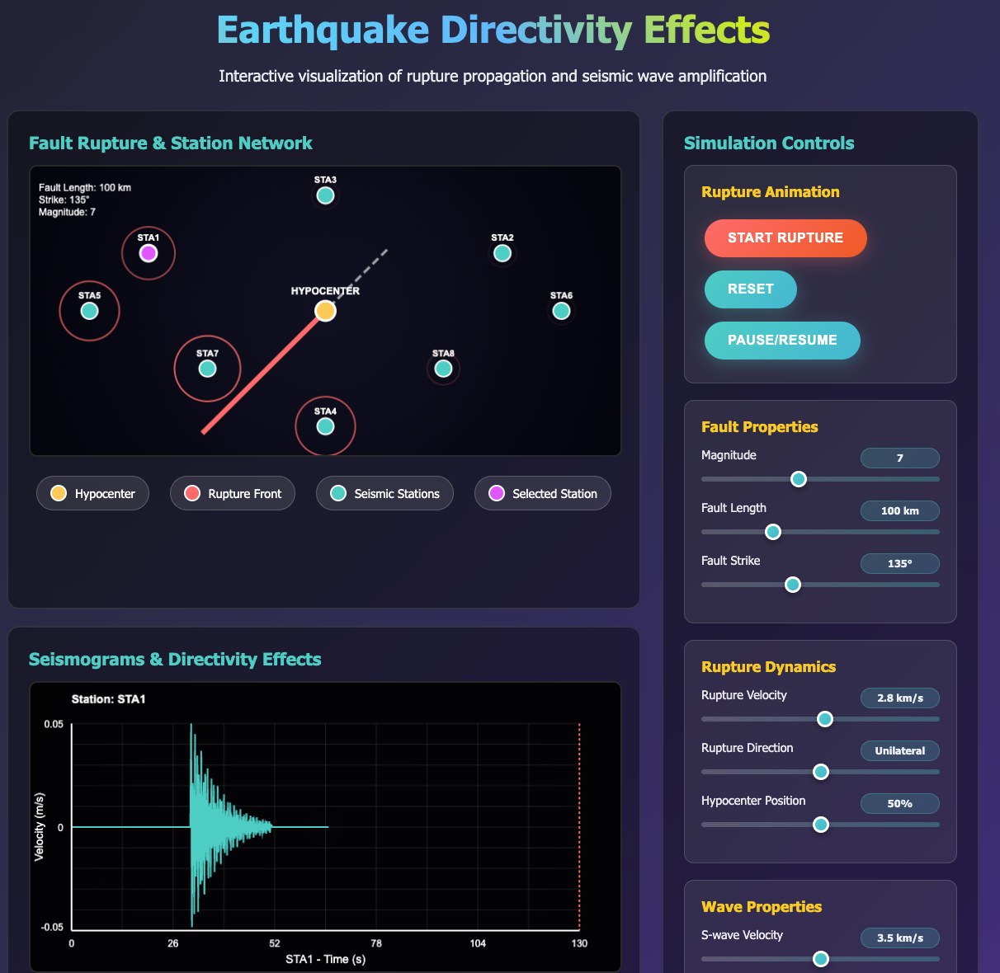
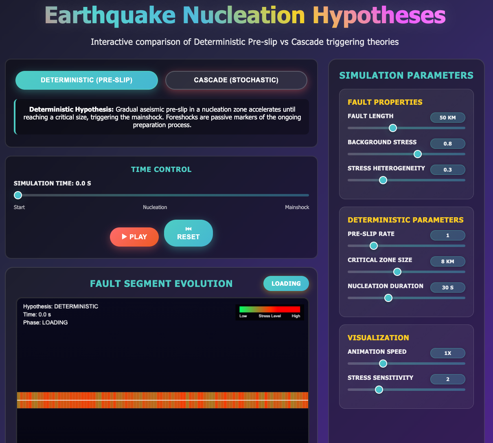
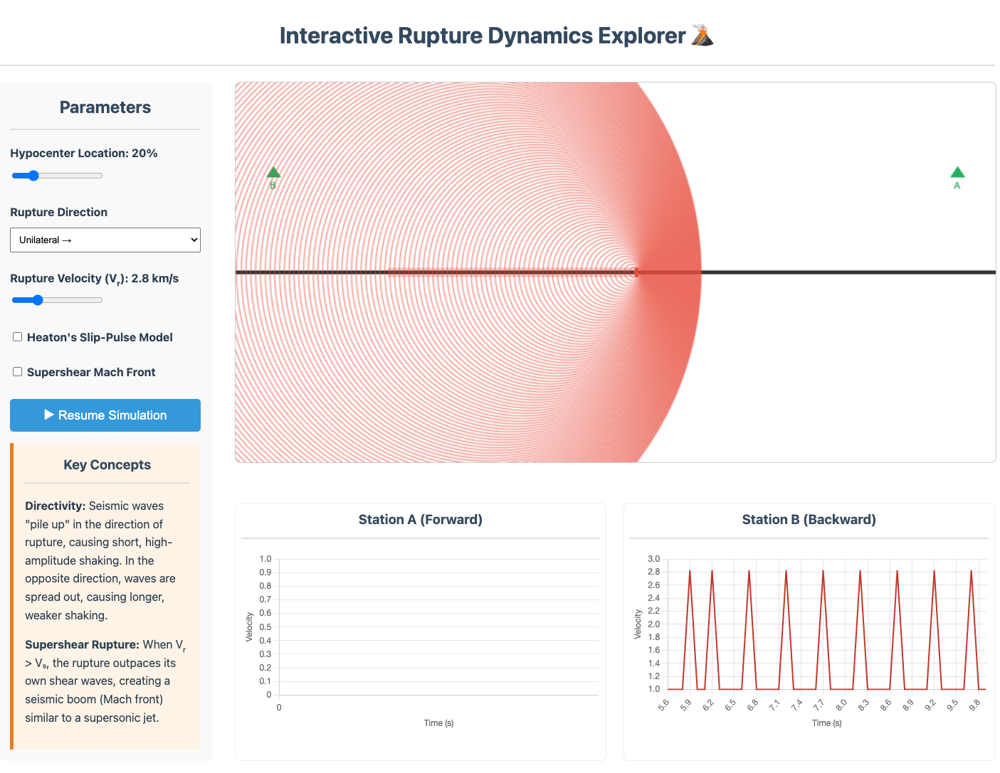
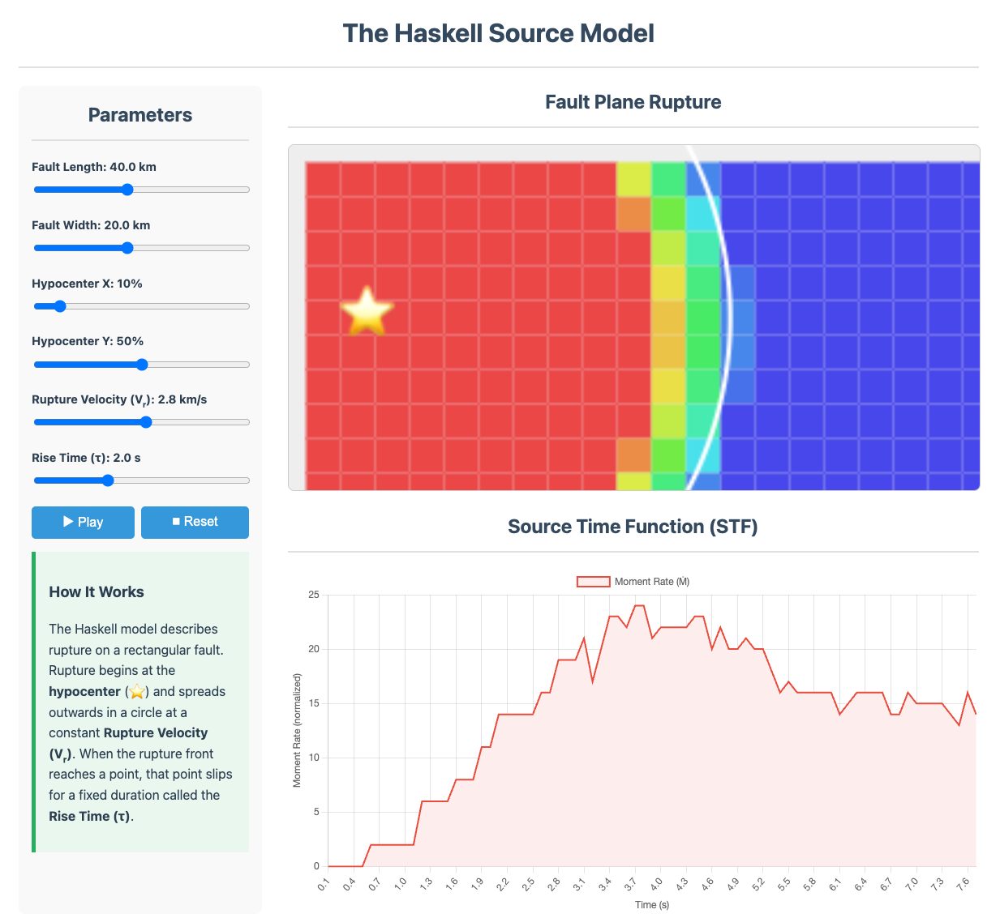
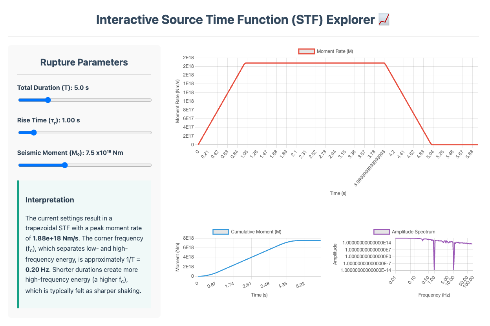
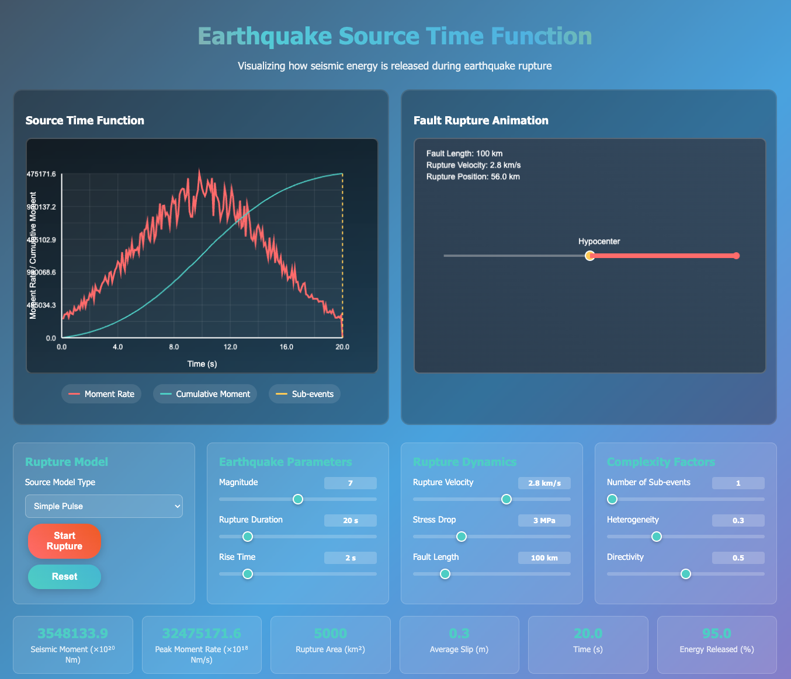

# Harvard EPS55

## Interactive Visualizations

### Click on each image to see the live interactive version:

---------------------------------------------------------
## Lecture 1: Eearthquake Impacts

<table>
  <tr align="center">
    <th>Earth's Timeline with Human Population Explosion</th>
    <th>Earthquake Timeline: Magnitude vs. Human Impact</th>
  </tr>
  
  <tr align="center">
    <td>
      
    </td>
    <td>
      
    </td>
  </tr>
</table>

---------------------------------------------------------
## Lecture 2: Geological Faults

<table>
  <tr align="center">
    <th>Fault types!</th>
    <th>Fault orientations (Strike, Dip, and Rake angles)!</th>
    <th>Mohr-Coulomb Failure!</th>
  </tr>
  
  <tr align="center">
    <td>
      
    </td>
    <td>
      
    </td>
    <td>
      
    </td>
  </tr>
</table>

  Increase principal stresses - try adjusting the sliders so the blue Mohr circle clearly crosses the red failure envelope. Watch the Mohr circle grow until it touches the failure line. You’ll see:

Change material properties - see how stronger materials (higher c, φ) resist failure

Compare different scenarios - weak vs. strong materials under various stress conditions

Understand the physics - why normal stress increases shear resistance

---------------------------------------------------------
## Lecture 6: Earthquake Cycle

<table>
  <tr align="center">
    <th>Coseismic Ground Displacement!</th>
    <th>Interseismic-Coseismic-Postseismic Phases!</th>
    <th>Interactive Spring-Block Earthquake Model!</th>
    <th>Interactive Recurrence Models with Rate-and-State Friction!</th>
    <th>Rate-and-State Friction Explorer!</th>
  </tr>
  
  <tr align="center">
    <td>
      
    </td>
    <td>
      
    </td>
    <td>
      
    </td>
    <td>
      
    </td>
    <td>
      
    </td>
  </tr>
</table>

---------------------------------------------------------

## Lecture 7: Fault Rupture

<table>
  <tr align="center">
    <th>Far-Field Apparent Rupture!</th>
    <th>Directivity Explorer!</th>
    <th>Earthquake Directivity Effects!</th>
    <th>Earthquake Nucleation Hypotheses!</th>
    <th>Interactive Rupture Dynamics Explorer!</th>
  </tr>
  
  <tr align="center">
    <td>
      
    </td>
    <td>
      
    </td>
    <td>
      
    </td>
    <td>
      
    </td>
    <td>
      
    </td>
  </tr>
</table>

<table>
  <tr align="center">
    <th>The Haskell Source Model!</th>
    <th>Interactive Source Time Function (STF) Explorer!</th>
    <th>Earthquake Source Time Function Calculator!</th>
  </tr>
  
  <tr align="center">
    <td>
      
    </td>
    <td>
      
    </td>
    <td>
      
    </td>
  </tr>
</table>
---------------------------------------------------------
